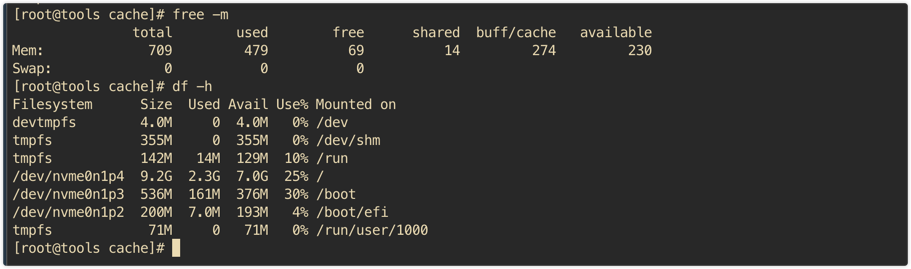
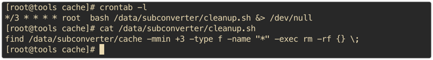

# subconverter

本仓库Fork了[tindy2013/subconverter](https://github.com/tindy2013/subconverter)的代码，增加了对Surge 5的支持。因为Surge 5的配置文件格式与Surge 4不同，所以需要修改代码，增加了`surge-ios`和`surge-macos`两个参数，用于区分Surge 5的配置文件格式。

需要配合前端chenyk/sub(即将上传至github)使用，或者修改URL的`target`为`surge-ios&ver=5`或者`surge-macos&ver=5`。

本人自搭的一个前端地址：[https://subconverter.inextops.com/](https://subconverter.inextops.com/)

服务器是白嫖的亚马逊的服务器，配置很低，请温柔对待

服务器每隔3分钟删除一次cache，理论上不会存在订阅泄露的问题，可以测试使用

* * *

## 新增内容

## 支持类型

- 原仓库支持

| 类型                     | 作为源类型 | 作为目标类型 | 参数             |
| ---------------------- | :---: | :----: | -------------- |
| Clash                  |   ✓   |    ✓   | clash          |
| ClashR                 |   ✓   |    ✓   | clashr         |
| Quantumult (完整配置)      |   ✓   |    ✓   | quan           |
| Quantumult X (完整配置)    |   ✓   |    ✓   | quanx          |
| Loon                   |   ✓   |    ✓   | loon           |
| Mellow                 |   ✓   |    ✓   | mellow         |
| SS (SIP002)            |   ✓   |    ✓   | ss             |
| SS (软件订阅/SIP008)       |   ✓   |    ✓   | sssub          |
| SSD                    |   ✓   |    ✓   | ssd            |
| SSR                    |   ✓   |    ✓   | ssr            |
| Surfboard              |   ✓   |    ✓   | surfboard      |
| Surge 2                |   ✓   |    ✓   | surge&ver=2    |
| Surge 3                |   ✓   |    ✓   | surge&ver=3    |
| Surge 4                |   ✓   |    ✓   | surge&ver=4    |
| Trojan                 |   ✓   |    ✓   | trojan         |
| V2Ray                  |   ✓   |    ✓   | v2ray          |
| 类 TG 代理的 HTTP/Socks 链接 |   ✓   |    ×   | 仅支持 `&url=` 调用 |
| Mixed                  |   ×   |    ✓   | mixed          |
| Auto                   |   ×   |    ✓   | auto           |

- 新增支持

| 类型            | 作为源类型 | 作为目标类型 | 参数                |
|---------------| :---: | :----: |-------------------|
| Surge 5 IOS   |   ✓   |    ✓   | surge-ios&ver=5   |
| Surge 5 MacOS |   ✓   |    ✓   | surge-macos&ver=5 |

